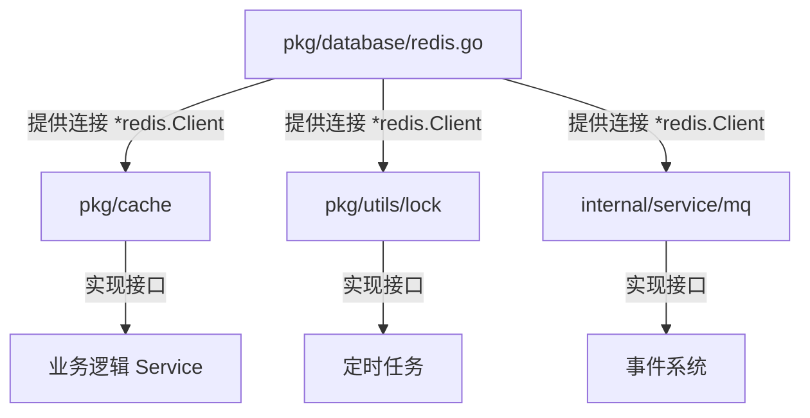

# Go 工程架构最佳实践：为什么 Database 和 Cache 要分离？

在本项目中，你可能会注意到 Redis 相关的代码出现在了两个不同的地方：

1.  `pkg/database/redis.go`
2.  `pkg/cache/redis.go`

初学者可能会觉得这是多余的，为什么不直接在一个文件里写完？这其实是 **Go 工程化架构 (Clean Architecture)** 中非常重要的设计原则体现：**关注点分离 (Separation of Concerns)** 和 **依赖倒置 (Dependency Inversion)**。

本文将详细解释这种设计的深层原因和巨大优势。

---

## 1. 核心概念对比

首先，我们需要明确这两个包的职责完全不同：

| 特性       | `pkg/database` (基础设施层)                     | `pkg/cache` (业务适配层)                    |
| :--------- | :---------------------------------------------- | :------------------------------------------ |
| **职责**   | **"如何连接"**                                  | **"如何使用"**                              |
| **关注点** | IP地址、端口、密码、连接池配置、健康检查 (Ping) | 设置 Key、读取 Key、序列化 (JSON)、过期时间 |
| **产出物** | 一个原始的 `*redis.Client` 指针                 | 一个实现了 `Cache` 接口的对象               |
| **层级**   | 最底层 (Infrastructure)                         | 中间层 (Interface Adapter)                  |

### 代码直观对比

**Layer 1: Infrastructure (`pkg/database/redis.go`)**
这层代码只关心如何把网线插上。它不关心你用 Redis 来存缓存、做锁还是发消息。

```go
// 只负责建立连接，返回底层客户端
func ConnectRedis(addr, password string, db int) (*redis.Client, error) {
    return redis.NewClient(...)
}
```

**Layer 2: Adapter (`pkg/cache/redis.go`)**
这层代码定义了缓存的行为。它不关心 Redis 连接是从哪里来的，它只关心："给我一个 Redis 客户端，我用它来实现缓存功能"。

```go
// 定义标准行为
type Cache interface {
    Set(ctx context.Context, key string, value interface{}, ttl time.Duration) error
    Get(ctx context.Context, key string, target interface{}) error
}

// 具体实现
type RedisCache struct {
    client *redis.Client // 依赖注入
}

// 封装业务逻辑 (例如自动 JSON 序列化)
func (c *RedisCache) Set(...) error {
    jsonBytes, _ := json.Marshal(value)
    return c.client.Set(..., jsonBytes, ...)
}
```

---

## 2. 为什么要这么做？三大优势

### 优势一：复用性 (Reusability) - 一源多用

Redis 在现代架构中是一个"万能军刀"，不仅仅用于 **缓存**。如果我们将 Redis 代码全部写死在 `cache` 包里，其他模块就无法复用这个连接了。

在我们的 `wallet-core` 项目中，同一个 `*redis.Client` 连接池被三个完全不同的模块共享：

1.  **缓存模块 (`pkg/cache`)**: 缓存汇率、用户信息。
2.  **分布式锁 (`pkg/utils/lock`)**: 防止资金归集并发冲突。
3.  **消息队列 (`internal/service/mq`)**: 使用 Redis Streams 处理充值事件。

**架构图示：**



这种设计使得我们只需要在启动时初始化**一次**连接 (`main.go`)，就可以将其注入到任何需要 Redis 的地方。

### 优势二：可替换性与接口编程 (Interface Segregation)

业务逻辑层（Service）不应该依赖具体的 Redis。想象一下，如果有一天你的老板说："Redis 太贵了，开发环境我们想用本机内存缓存 (`go-cache`) 省钱，生产环境才用 Redis。"

如果你的 Service 代码里写满了 `redis.Set(...)`，那你需要改写所有业务代码。

但如果你依赖的是 `Cache` **接口**：

```go
// 业务代码只依赖接口，不依赖 Redis
type AddressService struct {
    cache cache.Cache
}

// 甚至不知道底下是 Redis 还是 Memory
func (s *AddressService) GetData() {
    s.cache.Get(..., &data)
}
```

在 `main.go` 中，你可以随意切换：

```go
// 方案 A: 使用 Redis
svc := NewAddressService(..., cache.NewRedisCache(rdb))

// 方案 B: 使用内存 (开发环境)
svc := NewAddressService(..., cache.NewMemoryCache(...))
```

这就是我们项目中 `MultiLevelCache` (多级缓存) 能轻松实现的基础。

### 优势三：单元测试 (Testability)

在写单元测试时，我们通常不想真的去连一个 Redis 数据库（速度慢、需要环境）。

通过将 `pkg/database` 分离，我们在测试 Service 时，可以轻松传入一个 **Mock Cache**（模拟缓存），而不需要启动真实的 Redis 容器。

---

## 3. 总结

| 做法                                         | 评分       | 评价                                                                       |
| :------------------------------------------- | :--------- | :------------------------------------------------------------------------- |
| **All-in-One** (连接+逻辑全写在一起)         | ⭐         | **反模式**。典型的 "意大利面条代码"，难以测试，难以复用，难以维护。        |
| **Global Variable** (全局变量 `GlobalRedis`) | ⭐⭐       | **不推荐**。虽然解决了复用，但隐藏了依赖关系，导致代码耦合度高，测试困难。 |
| **Dependency Injection** (本文的做法)        | ⭐⭐⭐⭐⭐ | **最佳实践**。职责分明，连接层负责基建，适配层负责逻辑，业务层只依赖接口。 |

这就是为什么你会看到 `redis` 这个词出现在代码库的多个层级中。它们虽然名字里都有 Redis，但扮演的角色完全不同。
