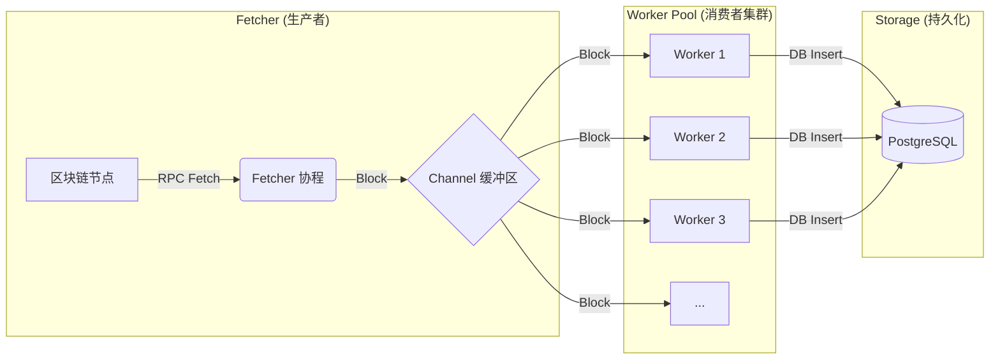

# 模块 3: 区块扫描器与并发架构 (Chain Observer & Worker Pools)

本模块实现了区块链钱包的核心组件之一：**区块扫描器 (Chain Observer)**。它的作用是像哨兵一样，7x24 小时监听区块链上的每一笔交易，从中发现属于我们用户的充值行为。

## 1. 核心架构设计

我们采用了经典的 **生产者-消费者 (Producer-Consumer)** 模型，利用 Go 语言的 `channel` 和 `goroutine` 特性，实现了高并发的交易处理。

### 架构图解



### 设计意图 (面试考点)

1.  **解耦 (Decoupling)**: Fetcher 只负责"搬砖"（获取区块），Worker 只负责"砌墙"（处理业务）。两者互不干扰，即使业务逻辑变复杂变慢，Fetcher 依然能满速拉取区块（直到缓冲区满）。
2.  **削峰填谷 (Backpressure)**: 我们使用了带缓冲的 `channel` (`make(chan *Block, workerCount*2)`).
    - 如果 Worker 处理不过来，Channel 会变满。
    - Fetcher 尝试向满的 Channel 发送数据时会**阻塞 (Block)**。
    - 这种机制自动限制了 Fetcher 的速度，防止内存溢出 (OOM)。
3.  **并发安全 (Concurrency Safety)**: Go 的 Channel 本身是并发安全的，多个 Worker 抢占同一个 Channel 中的数据不需要加锁。

## 2. 关键代码解析

### Fetcher (生产者)

```go
func (o *EthObserver) fetcher(ctx context.Context) {
    // ...
    for {
        // ... 获取区块 block ...
        select {
        case o.blocksChan <- block: // 将区块放入通道
            // 成功放入
        case <-ctx.Done():
            // 收到停止信号，退出
            return
        }
    }
}
```

- **注意**: `fetcher` 是单协程运行的，保证了区块的顺序性 (Block 100 -> 101 -> 102)。虽然 Worker 是乱序完成的，但区块进入系统的顺序是严格的。

### Worker (消费者)

```go
func (o *EthObserver) worker(ctx context.Context, id int) {
    // range channel 会一直从通道取数据，直到通道被 close
    for block := range o.blocksChan {
        // ... 业务逻辑 ...
    }
}
```

- **注意**: 我们启动了多个 Worker (`workerCount` = 5)。它们并行工作，极大提高了 CPU 利用率和 I/O 吞吐量。

### 业务逻辑：充值检测

```go
func (o *EthObserver) processTransaction(tx Transaction) {
    // 1. 查表：这笔交易的 To 地址，是我们的用户吗？
    // 实际生产中这里应该用 Redis Set 或布隆过滤器 (Bloom Filter) 优化，避免每次都查 DB
    var count int64
    o.db.Model(&model.Address{}).Where("address = ?", tx.To).Count(&count)

    if count > 0 {
        // 2. 是！入库
        // 幂等性关键：tx_hash 必须是唯一索引 (Unique Index)
        // 即使 Worker 重复处理了同一个块，数据库会报错拦截，保证资金安全
        o.db.Create(&deposit)
    }
}
```

## 3. 下一步演进

当前的实现是一个**单体应用内**的观察者。在企业级架构中，扫描器通常会拆分成独立的微服务：

1.  **Block Scanner Service**: 只负责扫块，发现充值交易后，不直接写 DB，而是发消息到 Kafka。
2.  **Wallet Core Service**: 订阅 Kafka 消息，处理入账逻辑。

这样做的好处是：

- **可靠性**: 扫描器挂了，重启接着扫，不影响核心钱包服务。
- **扩展性**: 支持几百条链，只需要增加 Scanner 实例，不需要改动核心钱包代码。

我们在接下来的 **Module 3.1** 中将引入 Redis Streams (轻量级 MQ) 来模拟这个过程。
