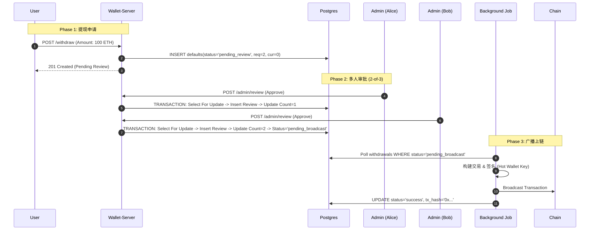
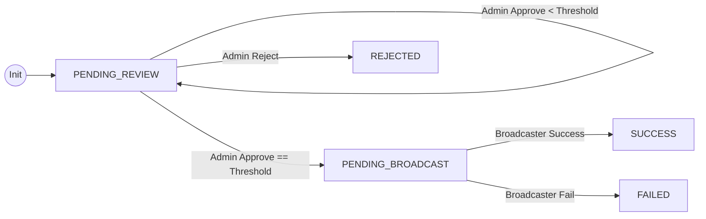

# Module 9: 多重签名架构大师课 (MultiSig Master Class)

> **文档即教学**: 本文档融合了理论基础、架构设计、底层原理与实战代码，旨在彻底讲透 "业务层多签" 的实现。

---

## 第一部分：理论基础 (Theory)

### 1.1 什么是多重签名 (M-of-N)？

在传统的 **单签 (Single Signature)** 模式下，资金的安全完全依赖于一把私钥。一旦私钥泄露或管理员作恶，资金即刻归零。
**多重签名 (MultiSig)** 引入了 `M-of-N` 的概念：

- **N (Total)**: 共有 N 个管理员拥有的私钥/权限。
- **M (Threshold)**: 至少需要 M 个人同意，交易才能执行。

> **核弹发射比喻**:
> 就像电影里的核弹发射井，不是一个人按按钮就能发射，需要两名将军同时插入钥匙并旋转（2-of-2），或者三名将军中的任意两人（2-of-3）。

### 1.2 三种主流实现流派

| 方案                          | 技术原语                   | 优点                                                              | 缺点                                                      | 适用场景                 |
| :---------------------------- | :------------------------- | :---------------------------------------------------------------- | :-------------------------------------------------------- | :----------------------- |
| **1. 链上合约 (On-Chain)**    | Smart Contract (Solidity)  | **Trustless** (不依赖人); 规则公开透明; 链上原生支持.             | **Costly** (每签一次都费 Gas); 只支持 EVM 链; 部署成本高. | Gnosis Safe, DAO 金库    |
| **2. MPC 门限签名 (TSS)**     | Cryptography (Math)        | **Gas Efficient** (链上只看作一笔普通签名); 支持所有链 (BTC/ETH). | **Complex** (数学极其复杂); 私钥分片仪式繁琐; 实现难度大. | Fireblocks, 交易所热钱包 |
| **3. 业务层多签 (Off-Chain)** | **Database + Permissions** | **Fast & Cheap** (0 Gas); 开发极快; 用户体验极其丝滑.             | **Trust Assumption** (需信任中心化服务器 DB 不被篡改).    | **CEX 后台**, 企业审批流 |

### 1.3 为什么我们选择“业务层多签”？

对于一个 **中心化钱包后端 (Wallet-Server)** 来说，方案 3 是性价比最高的选择：

1.  **全币种支持**: 不需要为 BTC, ETH, TRON 分别开发合约，一套逻辑通用所有链。
2.  **成本控制**: 审批过程完全在链下（数据库），没有 Gas 消耗。
3.  **架构兼容**: 完美契合现有的 Go + Postgres 架构。

---

## 第二部分：架构设计 (Architecture)

### 2.1 核心交互流程 (Sequence Diagram)

这里展示了从用户提现到最终上链的完整生命周期。



### 2.2 状态机设计 (State Machine)

提现单的状态流转必须是严谨的：



---

## 第三部分：底层原理剖析 (Under the hood)

在实现业务层多签时，最大的挑战是 **并发安全性 (Concurrency Safety)**。

### 3.1 竞态条件 (Race Condition)

假设 Admin A 和 Admin B 几乎同时点击“同意”。
如果代码写成：

```go
// ❌ 错误示范
w = db.Find(id)
w.CurrentApprovals += 1
db.Save(w)
```

1. A 读出 `count=0`。
2. B 读出 `count=0`。
3. A 写入 `count=1`。
4. B 写入 `count=1`。
   **结果**: 两人同意，但系统只记录了 1 票。资金卡死。

### 3.2 悲观锁 (Pessimistic Locking)

我们利用数据库的行级锁解决这个问题：

```go
// ✅ 正确示范
tx.Clauses(clause.Locking{Strength: "UPDATE"}).First(&w)
```

这段代码对应的 SQL 是 `SELECT * FROM withdrawals FOR UPDATE`。

- 当 Admin A 执行这句 SQL 时，数据库会**锁住**这一行。
- Admin B 的请求会**阻塞 (Block)**，直到 Admin A 的事务提交。
- 这保证了计数的 **强一致性**。

### 3.3 防重放 (Anti-Replay)

如何防止 Admin A 连续点击两次“同意”？
我们在 `withdrawal_reviews` 表中设置了联合唯一索引：

```sql
UNIQUE(withdrawal_id, admin_id)
```

数据库层面的约束是最坚固的防线，任何代码逻辑漏洞都无法突破这一层。

---

## 第四部分：实战指南 (Practice)

### 4.1 数据库 Schema (DDL)

我们在 `migrations/000002_add_multisig_tables.up.sql` 中实现了以下变更：

1.  **改造 Withdrawals 表**:
    - `status`: 扩展了状态枚举。
    - `required_approvals`: 固化了创建时的阈值要求（防止后续修改配置影响旧单）。
    - `current_approvals`: 实时计数器。
2.  **新建 WithdrawalReviews 表**:
    - 作为审计日志 (Audit Log)，记录每一笔投票。

### 4.2 代码实现清单

1.  **Request DTO**: `internal/handler/request/admin_request.go`
2.  **Service**: `internal/service/admin_service.go` (核心逻辑)
3.  **Handler**: `internal/handler/admin_handler.go`
4.  **Route**: `internal/server/routes/admin.go`

### 4.3 下一步开发：提现广播器 (The Broadcaster)

目前的系统在状态变为 `pending_broadcast` 后就停止了。我们需要实现一个 **Worker**：

1.  **轮询 (Poll)**: 每 10 秒查询 `status='pending_broadcast'` 的记录。
2.  **执行 (Execute)**:
    - 获取热钱包私钥。
    - 调用 `ethClient` 估算 Gas。
    - 签名并广播。
3.  **回调 (Callback)**: 更新 DB 状态为 `success` 并回填 `tx_hash`。

> 这部分将在接下来的 `internal/service/withdraw_broadcaster.go` 中实现。

---

## 第五部分：安全思考 (Security)

1.  **权限隔离**: 务必确保 `/admin` 路由组被中间件保护，只有拥有 `ROLE_ADMIN` 的 JWT Token 才能访问。
2.  **审计日志不可篡改**: `withdrawal_reviews` 表只能 Insert，严禁 Update/Delete。
3.  **阈值配置安全**: 建议将 `RequiredApprovals` 放在数据库配置表或环境变量中，且修改该配置需要最高权限。

---
