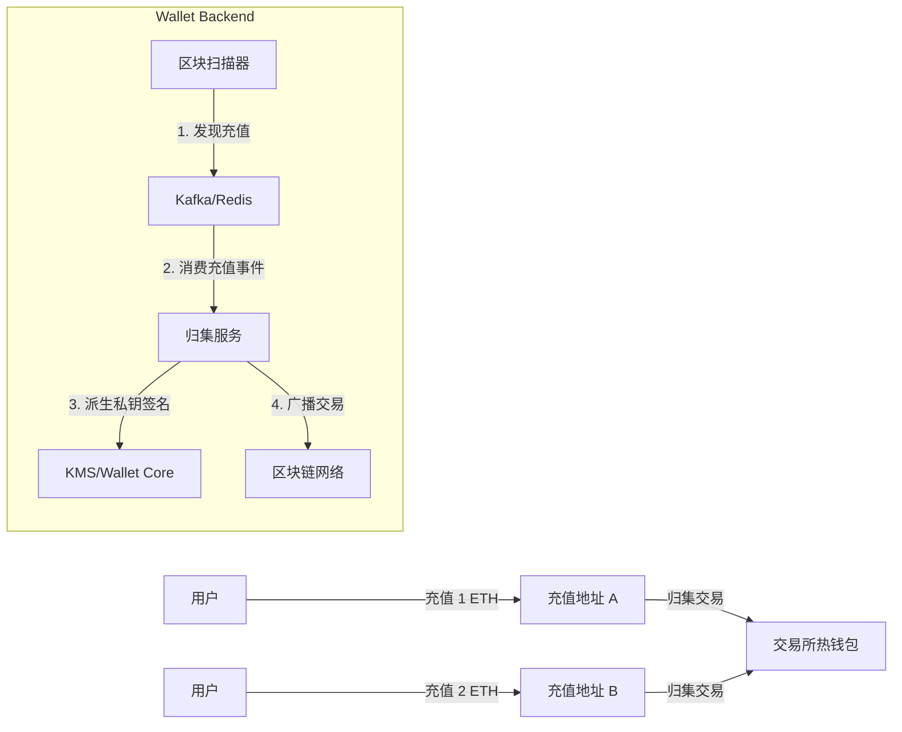

# Module 5 设计文档: 资金归集 (Funds Collection)

## 1. 什么是资金归集 (Sweeping)?

在中心化交易所/钱包中，用户充值的币实际上是打入了一个**临时生成的充值地址 (Deposit Address)**。
这些币如果散落在成千上万个小地址里，是无法被交易所使用的（例如用户提现时，不能从这些小地址直接转账，费率太高管理太难）。

**归集 (Collection/Sweeping)** 就是把这些分散的资金，统一转账到一个**大钱包 (Hot Wallet)** 的过程。

## 2. 核心架构



## 3. 实现步骤与难点

### 步骤 1: 监听充值事件

我们利用 Module 4 建立的 MQ，当 `EthObserver` 发现充值并写入 DB 后，发布消息。`Sweeper` 服务消费该消息。

### 步骤 2: 派生私钥 (Key Derivation)

**这是最危险的一步**。
我们需要使用 `Master Key` (xprv) 配合该地址的 `Derivation Path` (在 AddressService 中记录) 来实时计算出该地址的 `Private Key`。

- _安全原则_: 私钥用完即焚，不落盘。

### 步骤 3: 构造并签名交易

使用 `go-ethereum` 库：

1.  获取当前 Nonce。
2.  获取当前 Gas Price。
3.  计算转账金额: `Amount - GasFee` (如果是 ETH)。
    - _注意_: 如果余额不足以支付 Gas，则无法归集 (Dust Limit)。
4.  使用派生的私钥进行 EIP-155 签名。

### 步骤 4: 广播与记录

1.  广播 Signed Transaction 到网络。
2.  在数据库记录 `collections` 表，关联 `deposit_id`。

## 4. 关键面试题 (已集成)

1.  **Gas 费谁出?**
    - ETH/BTC: 直接从余额里扣 (`Amount - Fee`)。这会导致归集后的金额比充值金额少。
    - ERC20 (USDT): **这是大坑**。充值地址里只有 USDT 没有 ETH，无法支付 Gas。
    - _解决方案_: 必须先由热钱包往充值地址打一点 ETH (手续费)，这叫 "Gas Drip" 或 "加油"。本模块暂先实现 ETH 归集，避开这个复杂逻辑。
2.  **并发归集问题**
    - 如果扫描器误报了两次，或者 MQ 重复消费，会导致归集两次吗？
    - **解决**: 分布式锁 (Redis Lock) + 数据库唯一约束 (Unique Index on DepositID)。

## 5. 数据库设计 (新增)

**Collection 表**:

```sql
CREATE TABLE collections (
    id SERIAL PRIMARY KEY,
    deposit_id INT NOT NULL, -- 关联哪笔充值
    tx_hash VARCHAR(66) NOT NULL UNIQUE, -- 归集交易的 Hash
    from_address VARCHAR(42) NOT NULL,
    to_address VARCHAR(42) NOT NULL,
    amount DECIMAL(30, 0) NOT NULL,
    gas_fee DECIMAL(30, 0) NOT NULL,
    status VARCHAR(20) NOT NULL, -- 'pending', 'confirmed', 'failed'
    created_at TIMESTAMP DEFAULT CURRENT_TIMESTAMP
);
```
