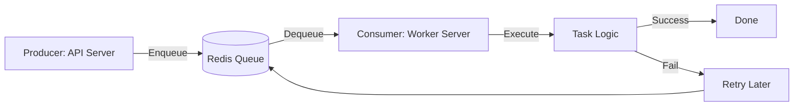

# Go 后端开发指南：异步任务队列 (Asynq)

在企业级高并发系统中，**异步任务队列 (Task Queue)** 是不可或缺的组件。它用于解耦核心业务与耗时任务，实现**削峰填谷**、**失败重试**和**分布式处理**。

本项目选用 `hibiken/asynq`，这是一个基于 Redis 的轻量级、高性能分布式任务队列库。

---

## 1. 核心概念 (Core Concepts)

### 为什么需要 Asynq？

- **解耦**: 用户注册成功后，需发送欢迎邮件。如果不使用队列，邮件服务挂了会拖累注册接口。
- **削峰**: 突然涌入 1万个请求，每个都要处理繁重的归集逻辑。队列可以将瞬时流量拉平，由 Worker 慢慢消费。
- **重试**: 网络抖动导致任务失败？Asynq 会自动根据指数退避策略 (Exponential Backoff) 重试，无需人工干预。

### 架构图解



### 关键组件

1.  **Client (Producer)**: 负责将任务推送到 Redis。通常集成在 API Server 中。
2.  **Server (Consumer/Worker)**: 负责从 Redis 拉取任务并执行。在生产环境中，它通常是一个**独立运行的进程** (Deployment)。
3.  **Task**: 任务的定义，包含 `Type` (任务名) 和 `Payload` (参数，通常是 JSON)。

---

## 2. 工程实践 (Implementation)

### 2.1 目录结构

我们将新增 `internal/worker` 目录：

```text
internal/
  worker/
    client.go       // [Producer] 封装 Asynq Client，供 Service 调用
    server.go       // [Consumer] 封装 Asynq Server，启动 Worker
    tasks/          // 任务定义与处理逻辑
      type.go       // 定义所有任务类型常量
      email.go      // 邮件任务 (Payload定义 + Handler实现)
      sweeper.go    // 归集任务
```

### 2.2 快速上手代码

#### A. 定义任务 (Task Definition)

```go
// internal/worker/tasks/type.go
const (
    TypeEmailDelivery = "email:deliver"
)

// internal/worker/tasks/email.go
type EmailDeliveryPayload struct {
    UserID  int64  `json:"user_id"`
    Subject string `json:"subject"`
}

// NewEmailDeliveryTask 创建任务对象 (Producer 用)
func NewEmailDeliveryTask(userID int64, subject string) (*asynq.Task, error) {
    payload, _ := json.Marshal(EmailDeliveryPayload{UserID: userID, Subject: subject})
    return asynq.NewTask(TypeEmailDelivery, payload), nil
}

// HandleEmailDeliveryTask 执行任务逻辑 (Consumer 用)
func HandleEmailDeliveryTask(ctx context.Context, t *asynq.Task) error {
    var p EmailDeliveryPayload
    if err := json.Unmarshal(t.Payload(), &p); err != nil {
        return fmt.Errorf("json.Unmarshal failed: %v: %w", err, asynq.SkipRetry)
    }
    // ... 发送邮件逻辑 ...
    return nil
}
```

#### B. 生产者 (Producer)

在 `internal/service` 中注入 `worker.Client`，然后调用：

```go
// 注册成功后
task, _ := tasks.NewEmailDeliveryTask(user.ID, "Welcome!")
// 立即执行
info, err := client.Enqueue(task)
// 或者：延迟 10 分钟执行
info, err := client.Enqueue(task, asynq.ProcessIn(10*time.Minute))
```

#### C. 消费者 (Consumer)

在 `main.go` 中启动：

```go
srv := asynq.NewServer(
    asynq.RedisClientOpt{Addr: "localhost:6379"},
    asynq.Config{
        Concurrency: 10, // 同时处理 10 个任务
        Queues: map[string]int{
            "critical": 6, // 优先级控制
            "default":  3,
            "low":      1,
        },
    },
)

mux := asynq.NewServeMux()
mux.HandleFunc(tasks.TypeEmailDelivery, tasks.HandleEmailDeliveryTask)

if err := srv.Run(mux); err != nil {
    log.Fatal(err)
}
```

---

## 3. 最佳实践 (Best Practices)

1.  **错误处理**:
    - 如果您希望任务重试，只需返回 `error`。
    - 如果您确定任务无法挽回（如 JSON 解析失败），返回 `asynq.SkipRetry`，任务会直接进死信队列 (Archived)。
2.  **优雅停机**: `asynq.Server` 收到信号时会等待正在执行的任务完成（默认超时会有个限制）。
3.  **Payload 精简**: 不要把整个 User 对象塞进 Payload，只传 `UserID`。Worker 拿到 ID 后再去查数据库，保证数据实时性。
4.  **幂等性**: 任务可能会被执行多次（因为网络超时 ACK 失败），业务逻辑必须保证幂等 (Idempotency)。

---

## 4. 监控 (Monitoring)

Asynq 提供了一个 Web UI (`asynqmon`) 用于监控队列状态。也可以使用 Prometheus Exporter 导出指标到 Grafana。
