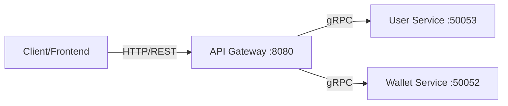

# Module 14: API Gateway (bc-gateway)

API Gateway 是微服务架构的流量入口，它对外暴露统一的 HTTP RESTful 接口，对内将请求路由到各个 gRPC 微服务。

## 1. 架构位置



## 2. 核心职责

- **协议转换**: HTTP -> gRPC
- **路由分发**: `/v1/user/*` -> User Service, `/v1/wallet/*` -> Wallet Service
- **认证鉴权**: (未来集成) 解析 JWT Token，提取 User ID
- **限流熔断**: (未来集成) 保护后端服务

## 3. 快速开始

### 3.1 启动依赖服务

确保 Postgres, Redis, User Service, Wallet Service 均已启动。

### 3.2 启动网关

```bash
# 在 wallet-core 根目录
go run cmd/bc-gateway/main.go
```

启动成功日志:

```
INFO  Starting Blockchain Gateway... {"port": "8080"}
INFO  Connected to User Service at localhost:50053
INFO  Connected to Wallet Service at localhost:50052
INFO  Gateway listening on HTTP {"addr": ":8080"}
```

### 3.3 测试接口

**注册用户:**

```bash
curl -X POST http://localhost:8080/v1/user/register \
  -H "Content-Type: application/json" \
  -d '{"username": "testuser", "password": "password123", "email": "test@example.com"}'
```

**查询余额:**

```bash
curl "http://localhost:8080/v1/wallet/balance?user_id=1&currency=ETH"
```

## 4. 开发指南

### 添加新接口

1.  **定义 Proto**: 在 `api/proto` 中修改 `.proto` 文件，运行 `make proto` 生成代码。
2.  **后端实现**: 在 `internal/service` 中实现 gRPC 逻辑。
3.  **网关接入**:
    - 修改 `internal/gateway/router.go`
    - 添加 Handler 方法
    - 将 HTTP 请求体 (JSON) 绑定到 Proto Request 结构体
    - 调用 gRPC Client
    - 返回 HTTP 响应

## 5. 常见问题

- **Connect Failed**: 检查后端微服务是否启动，端口是否正确 (Wallet: 50052, User: 50053)。
- **JSON Bind Error**: 检查请求体格式是否符合 Proto Message 定义（注意字段名通常是 snake_case）。
