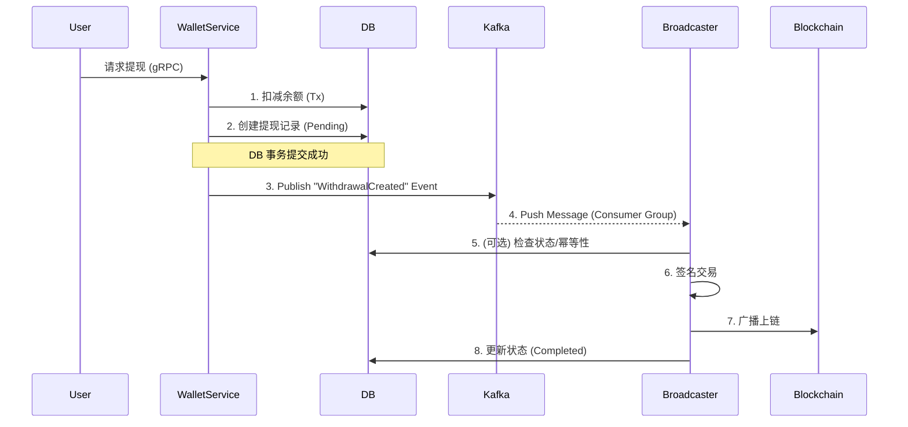

# Module 14: 事件驱动架构指南 (Kafka Integration)

本指南记录了如何将广播服务 (`broadcaster-worker`) 从传统的数据库轮询模式升级为基于 Kafka 的事件驱动架构。

## 1. 为什么需要事件驱动?

| 模式                        | 描述                                                                    | 缺点                                                                                                                     | 优点                                            |
| :-------------------------- | :---------------------------------------------------------------------- | :----------------------------------------------------------------------------------------------------------------------- | :---------------------------------------------- |
| **DB 轮询 (Polling)**       | Worker 每隔 5秒 执行 `SELECT * FROM withdrawals WHERE status='pending'` | 1. **延迟高**: 最多延迟 5秒<br>2. **数据库压力**: 空转时也在查库<br>3. **水平扩展难**: 多个 Worker 容易冲突 (需分布式锁) | 实现简单                                        |
| **事件驱动 (Event-Driven)** | Wallet Service 提现成功后 -> 发送 Kafka 消息 -> Worker 立即消费         | 1. **引入复杂性**: 需维护 Kafka<br>2. **一致性挑战**: 需保证 "数据库事务 + 消息发送" 的原子性                            | **低延迟** (毫秒级)<br>**解耦**<br>**削峰填谷** |

## 2. 架构设计



## 3. 实现细节

### 3.1 定义事件 (Schema)

位置: `internal/event/events.go`

```go
type WithdrawalCreatedEvent struct {
    WithdrawalID uint64 `json:"withdrawal_id"`
    UserID       uint64 `json:"user_id"`
    ToAddress    string `json:"to_address"`
    Amount       string `json:"amount"`
    Chain        string `json:"chain"`
}
```

### 3.2 生产者 (Wallet Service)

在 `CreateWithdrawal` 逻辑中，当数据库事务成功后，异步发送消息。

```go
// internal/service/wallet/service.go
go func() {
    payload, _ := json.Marshal(event)
    // 使用 UserID 作为 Key，保证同一用户的提现顺序
    producer.Publish(ctx, "wallet_events_withdrawal", userID, payload)
}()
```

### 3.3 消费者 (Broadcaster Worker)

使用 `config.Redis.MQType` 开关支持 Kafka 或 Redis Stream。

```go
// cmd/broadcaster-worker/main.go
consumer.Subscribe(ctx, "wallet_events_withdrawal", func(msg *mq.Message) error {
    // 1. 解析消息
    // 2. 幂等性检查 (查库 confirm status is pending)
    // 3. 执行广播
})
```

## 4. 如何验证?

1.  **启动环境**:

    ```bash
    docker-compose up -d kafka zookeeper postgres redis
    ```

2.  **配置开关**:
    在 `config.yaml` 或环境变量中设置 `REDIS_MQ_TYPE=kafka`。

3.  **日志观察**:
    - `wallet-service` 日志: `"MQ Mode: Kafka"`
    - `broadcaster-worker` 日志: `"MQ Mode: Kafka Consumer"`, `"收到提现事件 id=..."`。

## 5. 进阶思考 (面试题)

**Q: 如果消息发送失败了怎么办 (DB 扣钱了，Kafka 没发出去)?**
A: 目前的代码是简单的 "Fire and Forget"，存在一致性风险。
**解决方案**: 使用 **本地消息表 (Transactional Outbox)** 模式。

1. 在 DB 事务中同时插入一条 `outbox_messages` 记录。
2. 只要 DB 事务成功，消息就在库里，跑不掉。
3. 一个独立的 `Relay Service` 轮询 `outbox_messages` 表，发送给 Kafka，发送成功后删除记录。
   (我们在 Module 7 中已经实现了这个模式的简化版，可复用于此)。
