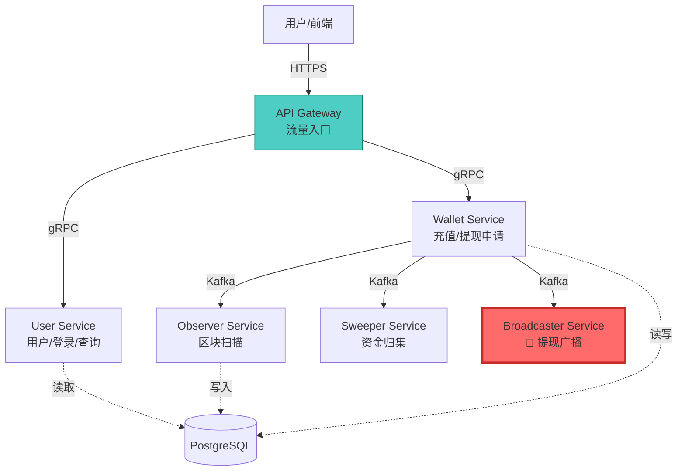

# Module 14: 微服务拆分架构指南 (Microservices Architecture Guide)

> **核心理念**: 知其然，知其所以然。本文档不仅告诉您"怎么拆"，更重要的是解释"为什么要拆"。

---

## 第一部分：现状诊断 (Current State)

### 1.1 我们现在是什么架构?

**单体架构 (Monolithic Architecture)**

所有功能都运行在一个进程 (`wallet-server`) 中：

```
wallet-server (PID: 12345)
├── HTTP Server (端口 8080) ────► 对外暴露 API
├── gRPC Server (端口 50051) ───► 内部服务调用
├── Observer Worker ────────────► 扫描区块
├── Sweeper Worker ─────────────► 资金归集
├── Broadcaster Worker ─────────► 🔐 提现广播 (持有私钥!)
└── Cron Jobs ──────────────────► 定时任务
```

**这是正确的起点**，因为：

- ✅ 开发效率高（不需要跨进程调试）
- ✅ 部署简单（一个 Docker 容器搞定）
- ✅ 性能好（所有调用都在内存里，无网络开销）

---

## 第二部分：为什么要拆? (The "Why")

### 2.1 核心矛盾：安全 vs 可用性

#### 致命风险场景

```go
// 现在的 main.go (简化版)
func main() {
    // 1. HTTP Server 对外暴露
    router := gin.Default()
    router.POST("/api/v1/withdraw", handler.CreateWithdrawal)
    go router.Run(":8080")

    // 2. Broadcaster 持有私钥 (在同一个进程!)
    masterKey := loadMasterKey() // 🔐 私钥在内存中
    broadcaster := service.NewBroadcasterService(masterKey)
    go broadcaster.Start()

    select {} // 阻塞主线程
}
```

**攻击路径**:

1. 黑客通过 SQL 注入拿到服务器 Shell
2. `ps aux | grep wallet-server` 找到进程 PID
3. `gdb -p 12345` Attach 到进程
4. `dump memory /tmp/mem.bin` 导出内存
5. 在内存中搜索私钥特征 (32 bytes hex)
6. **Game Over** - 热钱包被清空

#### 其他痛点

| 问题             | 描述                                                                                       | 影响          |
| :--------------- | :----------------------------------------------------------------------------------------- | :------------ |
| **资源竞争**     | Observer 需要 4GB 内存处理区块，但 HTTP API 只需 512MB。现在它们绑在一起，只能统一给 4GB。 | 💸 成本浪费   |
| **故障传播**     | Observer 内存泄漏崩溃 → 整个服务挂掉 → 用户连查询余额都做不了。                            | 😡 用户体验差 |
| **无法独立扩展** | 双十一流量暴增，需要扩容 HTTP API。但 Observer 不需要扩容，现在只能一起扩。                | 💸 成本浪费   |
| **部署风险**     | 修改了 Observer 的一行代码 → 必须重启整个服务 → 所有用户请求中断 30 秒。                   | 😡 可用性下降 |

---

## 第三部分：怎么拆? (The "How")

### 3.1 拆分原则

**按职责隔离 (Separation of Concerns)**

- 一个服务只做一件事，做到极致。

**按风险分级 (Risk-Based Isolation)**

- 持有私钥的服务 (Broadcaster) 必须物理隔离。

**按资源需求拆分 (Resource-Based Splitting)**

- 内存密集型 (Observer) 和 CPU 密集型 (API) 分开部署。

### 3.2 目标架构



### 3.3 服务职责划分

| 服务名             | 职责                           | 端口         | 安全等级 | 部署位置         |
| :----------------- | :----------------------------- | :----------- | :------- | :--------------- |
| **API Gateway**    | 流量入口、鉴权、路由转发、限流 | 8080 (HTTP)  | 低       | 公网 DMZ         |
| **User Service**   | 用户注册、登录、余额查询、账单 | 50051 (gRPC) | 低       | 内网             |
| **Wallet Service** | 充值地址生成、提现申请、审批流 | 50052 (gRPC) | 中       | 内网             |
| **Observer**       | 扫描区块、检测充值、更新余额   | - (Worker)   | 低       | 内网             |
| **Sweeper**        | 资金归集到热钱包               | - (Worker)   | 高       | 内网             |
| **Broadcaster**    | 🔐 **私钥签名、交易广播**      | - (Worker)   | **极高** | **物理隔离机房** |

---

## 第四部分：核心拆分 - Broadcaster 物理隔离

### 4.1 隔离方案

```
┌─────────────────────────────┐         ┌──────────────────────────┐
│  公网区域 (DMZ)              │         │  高安区域 (Air-Gapped)    │
│                             │         │                          │
│  ┌─────────────────┐        │         │  ┌──────────────────┐   │
│  │  API Gateway    │        │         │  │  Broadcaster     │   │
│  │  User Service   │        │  Kafka  │  │                  │   │
│  │  Wallet Service │◄───────┼─────────┼─►│  🔐 唯一有私钥   │   │
│  └─────────────────┘        │         │  │                  │   │
│                             │         │  │  ❌ 无公网 IP     │   │
│  ✅ 可以被黑客攻击           │         │  │  ❌ 无 SSH        │   │
│  ❌ 但没有私钥               │         │  │  ✅ 只能物理接触  │   │
└─────────────────────────────┘         └──────────────────────────┘
```

### 4.2 通信方式

**问题**: Broadcaster 不能联网，怎么接收提现请求?

**答案**: 单向消息队列 (Kafka)

```go
// Wallet Service (公网区)
func (s *WalletService) CreateWithdrawal(req *WithdrawalRequest) {
    // 1. 写入数据库
    db.Create(&Withdrawal{Status: "pending_broadcast"})

    // 2. 发送到 Kafka (单向通道)
    kafka.Publish("withdrawal_broadcast", withdrawalID)

    // 3. 立即返回 (不等待签名结果)
    return "提现申请已提交"
}

// Broadcaster Service (隔离区)
func (b *BroadcasterService) Start() {
    for msg := range kafka.Subscribe("withdrawal_broadcast") {
        // 1. 从数据库读取提现详情
        w := db.FindWithdrawal(msg.WithdrawalID)

        // 2. 用私钥签名
        signedTx := b.masterKey.Sign(w.ToAddress, w.Amount)

        // 3. 广播到区块链
        ethClient.SendTransaction(signedTx)

        // 4. 更新状态
        db.Update(&w, Status: "completed")
    }
}
```

**关键点**:

- Kafka 是 **单向通道** (只能从公网区推消息到隔离区)
- Broadcaster **不主动连接外部**，只被动消费消息
- 即使 Kafka 被黑，黑客也只能看到 `withdrawalID`，拿不到私钥

---

## 第五部分：实施路线图 (Roadmap)

### 5.1 阶段划分

**阶段 0: 理论学习 (当前)**

- ✅ 阅读本文档
- ✅ 理解"为什么要拆"
- ✅ 画出目标架构图

**阶段 1: 代码重构 (准备工作)**

- 将 `internal/service` 按业务拆分为独立包
- 定义 gRPC Proto 文件 (跨服务通信协议)
- 引入服务发现 (Consul/Etcd)

**阶段 2: 服务拆分 (逐步迁移)**

- 先拆 User Service (最简单，只读操作)
- 再拆 Wallet Service (有写操作，需要事务)
- 最后拆 Broadcaster (最复杂，涉及安全)

**阶段 3: 部署验证 (生产环境)**

- 在 K8s 中部署多服务
- 配置网络策略 (NetworkPolicy)
- 压力测试与监控

### 5.2 技术栈选型

| 组件            | 技术选型                  | 理由                      |
| :-------------- | :------------------------ | :------------------------ |
| **服务发现**    | Consul / K8s Service      | Consul 更灵活，K8s 更简单 |
| **API Gateway** | Kong / APISIX / 自研      | Kong 功能全，自研更可控   |
| **RPC 框架**    | gRPC (已有)               | 高性能、类型安全          |
| **消息队列**    | Kafka (已有)              | 高吞吐、持久化            |
| **配置中心**    | Consul KV / K8s ConfigMap | 动态配置更新              |

---

## 第六部分：常见问题 (FAQ)

### Q1: 微服务会不会让系统变慢?

**A**: 会，但可以接受。

- **单体**: 函数调用延迟 < 1μs
- **微服务**: gRPC 调用延迟 ~1ms (内网)

对于钱包系统，用户查询余额的总耗时是 **数据库查询 (50ms)** + **网络传输 (1ms)**，gRPC 的 1ms 可以忽略不计。

### Q2: 我现在就要拆吗?

**A**: 不需要!

微服务是 **架构演进的终点**，不是起点。正确的路径是：

1. 单体 (现在) → 把业务跑通
2. 模块化单体 → 代码按服务拆分，但还在一个进程
3. 微服务 → 真正拆成独立进程

**建议**: 等您的系统真的要上生产环境，或者 QPS 超过 1000 时再拆。

### Q3: 拆分后怎么调试?

**A**: 使用分布式追踪 (Distributed Tracing)

引入 Jaeger/Zipkin，每个请求带一个 `trace_id`，可以在 UI 上看到完整的调用链：

```
用户请求 (trace_id: abc123)
  └─ API Gateway (1ms)
      └─ User Service (5ms)
          └─ PostgreSQL (50ms)
```

---

## 第七部分：总结

**微服务不是银弹**，它解决的是 **规模化** 和 **安全隔离** 的问题。

对于您现在的学习阶段：

- ✅ **理解概念** 比写代码更重要
- ✅ 把单体做扎实，再考虑拆分
- ✅ 拆分的核心是 **Broadcaster 物理隔离**，这是安全的最后一道防线

**下一步建议**:

1. 继续完成 Module 9 (MultiSig/MPC) 的学习
2. 等完全理解了"为什么"，再看 Module 14 的实战代码
3. 不着急，**慢就是快**

---

**参考资料**:

- [Martin Fowler: Microservices](https://martinfowler.com/articles/microservices.html)
- [Google SRE Book: Service Reliability](https://sre.google/sre-book/table-of-contents/)
- [Binance Architecture Blog](https://www.binance.com/en/blog)
