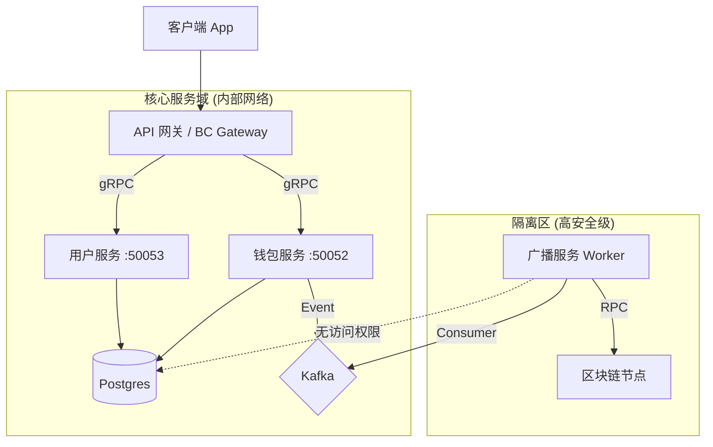

# Module 14: 微服务拆分设计文档

## 1. 架构概览 (目标状态)

单体架构的 `wallet-server` 正在被拆分为物理隔离的微服务。

## 2. 服务定义

### 2.1 用户服务 (User Service)

- **代码路径**: `cmd/user-service`
- **端口**: 50053 (gRPC)
- **职责**:
  - 用户注册/登录 (认证鉴权)
  - 用户个人资料管理
  - 安全设置 (2FA)
- **依赖**: Postgres (读/写)
- **状态**: ✅ 第一阶段已完成

### 2.2 钱包服务 (Wallet Service)

- **代码路径**: `cmd/wallet-service`
- **端口**: 50052 (gRPC)
- **职责**:
  - 地址生成
  - 余额管理
  - 充值/提现核心逻辑
- **依赖**: Postgres (读/写), Redis (分布式锁)
- **状态**: ✅ 第二阶段已完成

### 2.3 广播服务 (Broadcaster)

- **代码路径**: `cmd/broadcaster-worker`
- **类型**: Worker (无入站端口)
- **职责**:
  - 消费 `withdrawals` 提现单 (支持 DB 轮询 / Kafka)
  - 交易签名 (持有私钥!)
  - 广播交易上链
- **状态**: ✅ 第三阶段 MVP 已完成 (DB 轮询模式)

## 3. 通信方式

- **外部 -> 网关**: REST/HTTP
- **网关 -> 服务**: gRPC (Protobuf)
- **服务 -> 服务**: gRPC (同步) 或 Kafka (异步解耦)

## 4. 验证检查点

- **Proto 定义**: `api/proto/user.proto`, `api/proto/wallet.proto`
- **核心实现**: `internal/service/user/service.go`, `internal/service/wallet/service.go`
- **入口文件**: `cmd/*/main.go`
- **构建状态**: 所有服务均可成功编译 (`go build`).
