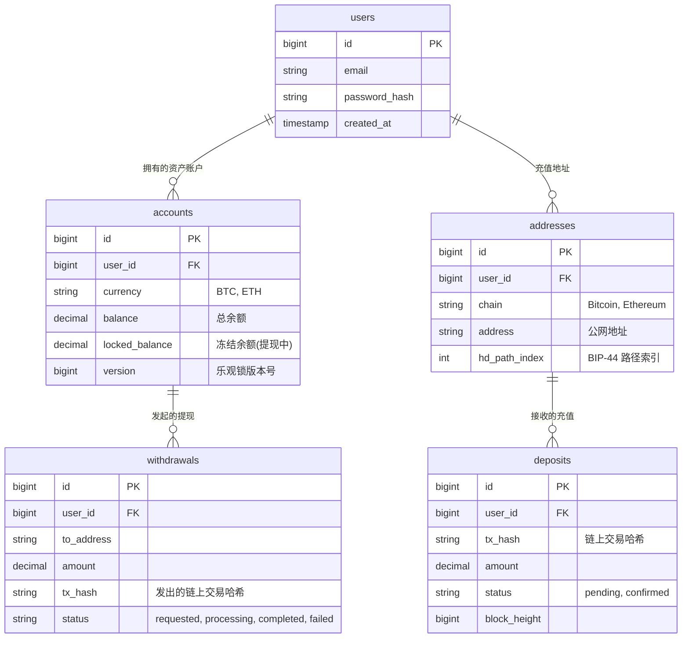

# 模块 3: 中心化钱包数据库设计 (PostgreSQL)

在开始写 Go 代码之前，我们必须先锁定数据库结构。这是中心化钱包的"地基"。
我们的目标是设计一个**满足 ACID (原子性、一致性、隔离性、持久性)** 的财务系统。

## 1. 实体关系图 (ER Diagram)



## 2. 核心表设计详解

### 2.1 用户表 (`users`)

基础的用户信息。

```sql
CREATE TABLE users (
    id BIGSERIAL PRIMARY KEY,
    username VARCHAR(255) NOT NULL UNIQUE,
    email VARCHAR(255) NOT NULL UNIQUE,
    password_hash VARCHAR(255) NOT NULL,
    created_at TIMESTAMP WITH TIME ZONE DEFAULT CURRENT_TIMESTAMP,
    updated_at TIMESTAMP WITH TIME ZONE DEFAULT CURRENT_TIMESTAMP
);
```

### 2.2 资产账户表 (`accounts`) - **最关键**

这是用户的"钱包余额"。

- **设计难点**: 如何防止并发修改导致的金额错误？
- **解决方案**: 引入 `version` 字段实现**乐观锁 (Optimistic Locking)**。
- **更新逻辑**:
  ```sql
  UPDATE accounts
  SET balance = balance + 100, version = version + 1
  WHERE id = 1 AND version = 5; -- 必须匹配当前版本号
  ```

```sql
CREATE TABLE accounts (
    id BIGSERIAL PRIMARY KEY,
    user_id BIGINT NOT NULL REFERENCES users(id),
    currency VARCHAR(10) NOT NULL, -- 'BTC', 'ETH'
    balance DECIMAL(32, 18) NOT NULL DEFAULT 0, -- 支持高精度
    locked_balance DECIMAL(32, 18) NOT NULL DEFAULT 0, -- 提现冻结中
    version BIGINT NOT NULL DEFAULT 0, -- 乐观锁版本
    created_at TIMESTAMP WITH TIME ZONE DEFAULT CURRENT_TIMESTAMP,
    updated_at TIMESTAMP WITH TIME ZONE DEFAULT CURRENT_TIMESTAMP,
    UNIQUE(user_id, currency) -- 每个用户每种币只有一个账户
);
```

### 2.3 充值地址表 (`addresses`)

记录分配给用户的充值地址。

- **hd_path_index**: 关键字段。我们需要记住这个地址是 HD 钱包的第几个子地址（例如 `m/44'/0'/0'/0/5` 中的 `5`），以便将来归集资金时能推导出对应的私钥签名。

```sql
CREATE TABLE addresses (
    id BIGSERIAL PRIMARY KEY,
    user_id BIGINT NOT NULL REFERENCES users(id),
    chain VARCHAR(20) NOT NULL, -- 'bitcoin', 'ethereum'
    address VARCHAR(255) NOT NULL,
    hd_path_index INTEGER NOT NULL, -- BIP-44 address_index
    created_at TIMESTAMP WITH TIME ZONE DEFAULT CURRENT_TIMESTAMP,
    UNIQUE(chain, address),
    UNIQUE(chain, hd_path_index) -- 路径索引不能重复使用
);
```

### 2.4 充值记录表 (`deposits`)

记录从链上扫描到的充值。

- **幂等性**: `tx_hash` + `log_index` (对于 ETH) 必须唯一，防止同一笔充值被重复入账。

```sql
CREATE TABLE deposits (
    id BIGSERIAL PRIMARY KEY,
    user_id BIGINT NOT NULL REFERENCES users(id),
    block_app_id BIGINT NOT NULL REFERENCES addresses(id), -- 关联到哪个地址收到的
    tx_hash VARCHAR(255) NOT NULL,
    amount DECIMAL(32, 18) NOT NULL,
    block_height BIGINT NOT NULL,
    status VARCHAR(20) NOT NULL, -- 'pending' (确认中), 'confirmed' (已入账)
    created_at TIMESTAMP WITH TIME ZONE DEFAULT CURRENT_TIMESTAMP,
    UNIQUE(tx_hash, block_app_id) -- 简化约束，实际可能需要更复杂
);
```

---

## 3. 下一步实施计划

1.  **基础设施**: 编写 `docker-compose.yml` 启动 PostgreSQL 和 Redis。
2.  **ORM 层**: 使用 GORM 或 sqlx 定义这些 Go Struct。
3.  **核心服务**: 实现 `AccountService` (开户、查询) 和 `WalletService` (生成地址)。
